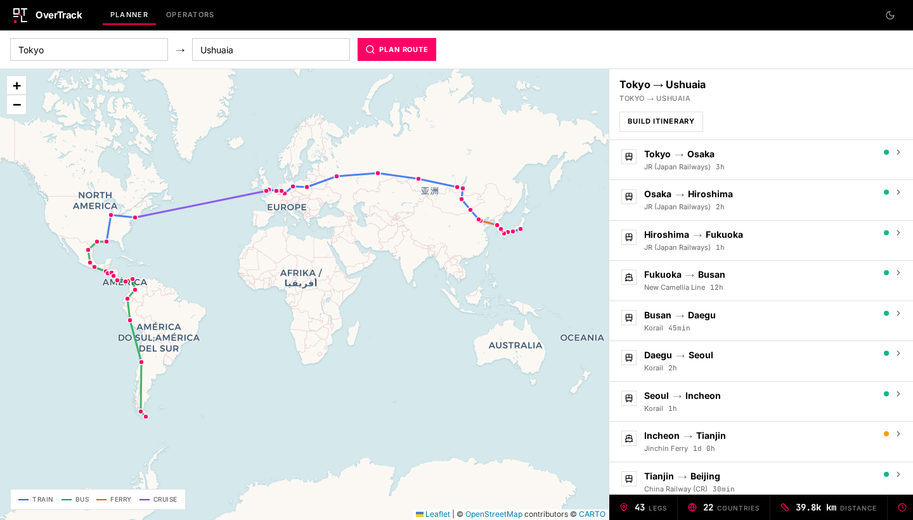

<div align="center">

<br>

<picture>
  <source media="(prefers-color-scheme: dark)" srcset="https://img.shields.io/badge/OVER-TRACK-FF0066?style=for-the-badge&labelColor=000&color=FF0066">
  <source media="(prefers-color-scheme: light)" srcset="https://img.shields.io/badge/OVER-TRACK-FF0066?style=for-the-badge&labelColor=000&color=FF0066">
  
</picture>

<br><br>

**Overland travel route planner.**
<br>
From Tokyo to Antarctica, no flights required.

<br>

[](LICENSE)
[](https://react.dev)
[](https://typescriptlang.org)
[](https://tailwindcss.com)
[](https://leafletjs.com)

<br>

<picture>
  <source media="(prefers-color-scheme: dark)" srcset="docs/screenshot-dark.png">
  <source media="(prefers-color-scheme: light)" srcset="docs/screenshot-light.png">
  
</picture>

</div>

<br>

---

<br>

## Overview

OverTrack computes feasible multi-country overland routes using trains, buses, ferries, and cruise ships. Enter any two cities and receive a complete journey plan with operators, durations, border crossing notes, and carbon footprint comparisons against flying.


## Features

```
PATHFINDING       Dijkstra shortest-path across 191 cities, 254 connections
OPERATORS         103 transport operators with booking links
MAP               Interactive Leaflet with CartoDB light/dark tiles
ITINERARY         Adjustable rest days, departure date, pace settings
CO₂               Carbon footprint comparison — overland vs. flying
DARK MODE         System-aware theme with native dark map tiles
```


## Quick Start

```bash
git clone https://github.com/Okyumi/OverTrack.git
cd OverTrack
npm install --legacy-peer-deps
npm run dev
```

Open **http://localhost:5000** — the default route loads Tokyo → Ushuaia.

<br>

## Architecture

```
client/src/
├── components/
│   ├── Navbar.tsx           # Always-black nav with OT monogram
│   ├── RouteMap.tsx         # Leaflet map with dual CartoDB tiles
│   ├── LegsList.tsx         # Expandable route legs sidebar
│   └── RouteStats.tsx       # Black stats bar with mono numbers
├── pages/
│   ├── route-planner.tsx    # Main map + sidebar layout
│   ├── operators.tsx        # Filterable operator directory
│   └── itinerary.tsx        # Timeline builder with CO₂ card
└── lib/
    ├── theme.tsx            # System-aware dark mode (no localStorage)
    └── queryClient.ts       # TanStack Query + API helpers

server/
├── routes.ts               # Express API endpoints
└── storage.ts              # In-memory graph + Dijkstra pathfinding

shared/
└── schema.ts               # Drizzle schema + Zod validation
```

<br>

## Tech Stack

| Layer | Technology |
|---|---|
| Frontend | React 19 · Tailwind CSS 3 · shadcn/ui · Leaflet + react-leaflet |
| Backend | Express · Drizzle ORM · In-memory storage |
| Routing | Wouter with hash-based navigation |
| Data | TanStack React Query v5 |
| Build | Vite 7 · TypeScript · esbuild |

<br>

## Route Data

The database covers overland connections spanning four continents:

| Region | Coverage |
|---|---|
| **East Asia** | Japan rail (Shinkansen), South Korea (KTX/Korail), China (CR high-speed) |
| **Central Asia** | Trans-Mongolian, Trans-Siberian, Kazakhstan–Uzbekistan corridors |
| **Europe** | Eurostar, TGV, Deutsche Bahn, Thalys, Flixbus network |
| **Middle East & Africa** | Turkey–Iran, East Africa bus routes, Southern Africa rail |
| **South America** | Andean buses, Chile–Argentina crossings, Patagonia to Ushuaia |

Each connection includes: operator, duration, distance, confidence level (verified / likely / unverified), border crossing notes, and visa information.

<br>

## Production Build

```bash
npm run build
NODE_ENV=production node dist/index.cjs
```

<br>

## License

MIT

<br>

---

<div align="center">
<sub>Built with precision.</sub>
</div>
